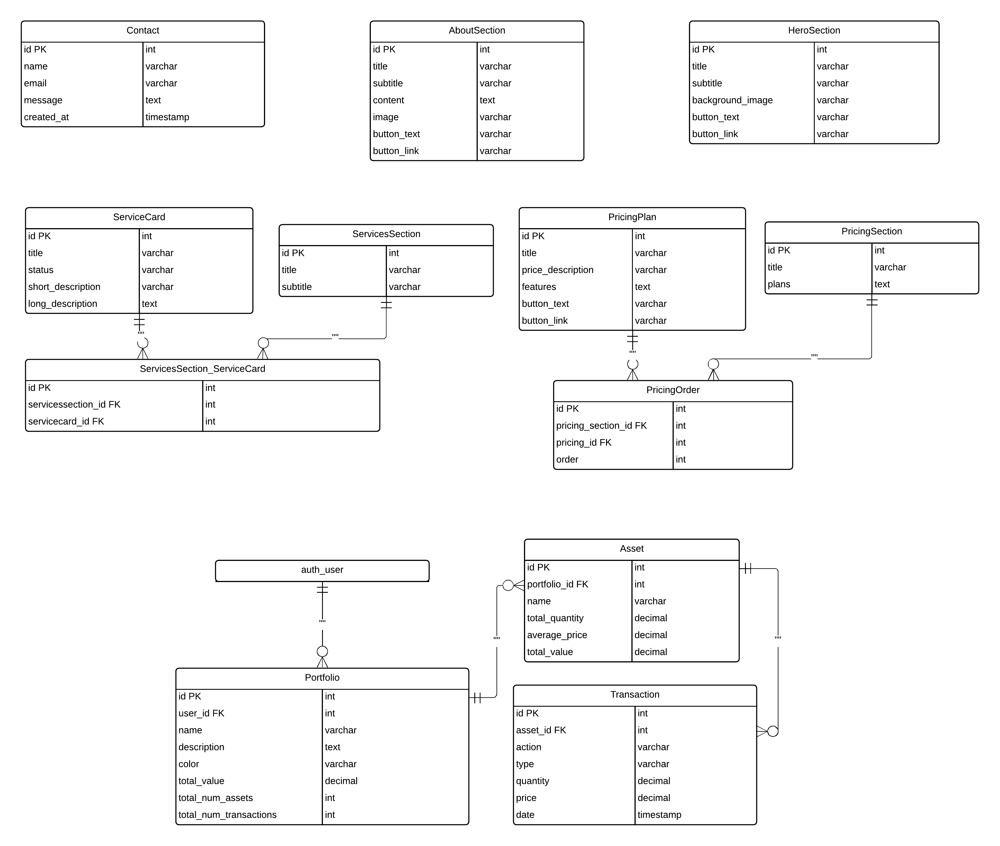

# Investnest

[Live project can be viewed here](https://investnest-b2db9f69475b.herokuapp.com/)

InvestNest is a full-stack web application designed to help users manage their investment portfolios. The application allows users to create, manage, and track their investment portfolios while providing real-time data integration, user-friendly reports, and robust authentication mechanisms.

# Table of Contents

# Description

InvestNest is a comprehensive investment portfolio management system that provides users with the tools to monitor and manage their investments. It integrates with real-time market data sources to keep portfolio values updated and includes powerful reporting and analytics features.

# User Experience

InvestNest is built with user experience at its core, providing intuitive navigation, clear feedback, and robust security features. Users can easily manage their portfolios, view detailed performance metrics, and customize their experience with personalized settings.

# Agile Methodology and Planning

## Epics

A total of 6 epics were designed for the project, with the project delivery focused on Epic 3. Each of Epics 1, 2, and 3 was executed in individual sprints. Epics 4, 5, and 6 are not planned for execution at this stage and are considered future expansions.

### Epic 1: Project Setup and Initial Configuration

In this epic, the primary objective is to fully establish the Django front-end website, with comprehensive content management through the admin dashboard. Key deliverables include the creation of branding elements and the development of a functional, polished landing page that reflects the final version of the site. Additionally, this epic covers the initial setup, including the installation of essential Python modules and the configuration of testing parameters to ensure the front-end website operates smoothly.

#### User Stories

- [STORY 1.1 - As a developer, I want to set up the Django environment and establish the initial project structure so that the project has a solid foundation for further development.](https://github.com/catapam/investnest/issues/106)
- [STORY 1.2 - As a developer, I want to select and configure a SQL database (MySQL or PostgreSQL) so that the project has a reliable and scalable data storage solution.](https://github.com/catapam/investnest/issues/107)
- [STORY 1.3 - As a developer, I want to deploy the Django project to Heroku so that the application is accessible online and ready for further development.](https://github.com/catapam/investnest/issues/108)
- [STORY 1.4 - As a developer, I want to create and integrate basic front-end templates so that the application has a consistent design and user experience.](https://github.com/catapam/investnest/issues/109)
- [STORY 1.5 - As a developer, I want to establish copyright, branding, and basic project documentation so that the project is legally compliant and easy to understand.](https://github.com/catapam/investnest/issues/110)
- [STORY 1.6 - As a developer, I want to implement automated testing using Python so that the project's codebase remains stable and errors are caught early in development.](https://github.com/catapam/investnest/issues/111)

### Epic 2: User Authentication and Authorization

This epic focuses on implementing a robust user authentication and authorization system. The goal is to enable secure user registration, login, and access management. Core tasks include integrating Django’s authentication framework, setting up user roles and permissions, and ensuring data security through encryption. By the end of this epic, the website will support secure user interactions, with role-based access control fully implemented.

#### User Stories

- [STORY 2.1 - As a user, I want to register an account so that I can access the system.](https://github.com/catapam/investnest/issues/2)
- [STORY 2.2 - As a user, I want to log in to my account so that I can access my portfolio.](https://github.com/catapam/investnest/issues/3)
- [STORY 2.3 - As a user, I want to reset my password if I forget it so that I can regain access to my account.](https://github.com/catapam/investnest/issues/5)
- [STORY 2.4 - As an admin, I want to assign roles to users so that I can control access to different functionalities.](https://github.com/catapam/investnest/issues/6)

### Epic 3: Portfolio Management (Project Delivery)

Epic 3 is the pivotal point of the project, where the primary delivery occurs. The focus is on delivering the project’s core functionality: a portfolio management system. This includes developing features that allow users to create, view, and manage their investment portfolios. Key aspects include data modeling, implementing portfolio tracking tools, and creating a user-friendly interface for portfolio management. This epic represents the main delivery milestone of the project, ensuring that the essential features are completed and ready for use.

#### User Stories

- [STORY 3.1 - As an investor, I want to create a new investment portfolio so that I can start tracking my investments.](https://github.com/catapam/investnest/issues/8)
- [STORY 3.2 - As an investor, I want to add assets to my portfolio so that I can track their performance.](https://github.com/catapam/investnest/issues/9)
- [STORY 3.3 - As an investor, I want to update the information of an asset in my portfolio so that it reflects the correct data.](https://github.com/catapam/investnest/issues/10)
- [STORY 3.4 - As an investor, I want to remove an asset from my portfolio so that I can keep my portfolio information current.](https://github.com/catapam/investnest/issues/11)
- [STORY 3.5 - As an investor, I want to view the performance of my portfolio so that I can monitor my investment progress.](https://github.com/catapam/investnest/issues/12)

### Epic 4: Real-Time Data Integration (Planned for Future Enhancements)

The goal of Epic 4 is to enhance the website with real-time data integration capabilities. This involves connecting the site to live data feeds, such as stock market updates, to provide users with up-to-date information. Tasks include setting up API connections, processing incoming data, and displaying it dynamically on the site. This epic is planned for future development, aiming to provide users with timely, relevant information that enhances their decision-making process.

#### User Stories

- [STORY 4.1 - As an investor, I want to get real-time price updates for my assets so that I have the latest information.](https://github.com/catapam/investnest/issues/14)
- [STORY 4.2 - As a developer, I want to integrate with market data APIs so that I can fetch real-time prices for asset](https://github.com/catapam/investnest/issues/15)
- [STORY 4.3 - As an investor, I want to receive alerts for significant price changes so that I can take timely action.](https://github.com/catapam/investnest/issues/16)

### Epic 5: Reporting and Analytics (Planned for Future Enhancements)

In this epic, the focus shifts to developing advanced reporting and analytics features. The objective is to provide users with insightful data about their investments through customizable reports and visual analytics. Core tasks include implementing data aggregation, creating various report templates, and integrating interactive charts and graphs. This epic is planned for future enhancements to empower users with detailed insights into their investment performance.

#### User Stories

- [STORY 5.1 - As an investor, I want to generate performance reports for my portfolio so that I can review my investment performance.](https://github.com/catapam/investnest/issues/18)
- [STORY 5.2 - As an investor, I want tools to analyze the risk associated with my portfolio so that I can make informed investment decisions.](https://github.com/catapam/investnest/issues/19)
- [STORY 5.3 - As an investor, I want visualizations (charts, graphs) of my portfolio data so that I can easily interpret performance and trends.](https://github.com/catapam/investnest/issues/20)

### Epic 6: User Notifications (Planned for Future Enhancements)

The final initial epic involves setting up a comprehensive user notification system. This includes the ability to send email alerts, in-app notifications, and push notifications for critical events such as portfolio updates, market changes, or new investment opportunities. The goal is to keep users informed and engaged, ensuring they never miss important information. This epic is planned for future development and will focus on enhancing user interaction and engagement through timely and relevant notifications.

#### User Stories

- [STORY 6.1 - As an investor, I want to receive notifications for successful transactions so that I am aware of any changes to my portfolio.](https://github.com/catapam/investnest/issues/22)
- [STORY 6.2 - As an investor, I want to receive alerts when my portfolio reaches certain performance thresholds so that I can take timely action.](https://github.com/catapam/investnest/issues/23)
- [STORY 6.3 - As an investor, I want to receive notifications for system updates and important announcements so that I am always informed about the platform.](https://github.com/catapam/investnest/issues/24)

## MoSCoW Methodology

The first three epics and their stories are essential for the project delivery, providing all necessary features and expected standards. Therefore, most of these tasks are classified as 'Must Have' or 'Should Have.'

User stories are broken down into tasks, where each task is categorized as 'Must Have,' 'Should Have,' 'Could Have,' or 'Won’t Have.' Each task is also assigned a story point weight of 1, 2, or 4, reflecting the effort required to complete it.

The story point weight and MoSCoW priority of each task for the three sprints (Epics 1, 2, and 3) were carefully planned to allow flexibility in execution. 'Must Haves' do not exceed 60% of the sprint's total story points. The details for each sprint are provided below:

### Sprint/Epic 1

**Story Point / MoSCoW** | **Must Have** | **Should Have** | **Could Have**
:-----:|:-----:|:-----:|:-----:
**1** | 10 | 0 | 0
**2** | 10 | 4 | 0
**4** | 1 | 2 | 2
**Total** | 34 | 16 | 8

- Total story points: 58
- Total 'Must Have': 34
- Must Have proportion: 58.62%

[Sprint 1 story point weight graph](https://github.com/users/catapam/projects/2/insights/4)

### Sprint/Epic 2

**Story Point / MoSCoW** | **Must Have** | **Should Have** | **Could Have**
:-----:|:-----:|:-----:|:-----:
**1** | 4 | 3 | 0
**2** | 9 | 5 | 7
**4** | 0 | 0 | 2
**Total** | 22 | 13 | 22

- Total story points: 57
- Total 'Must Have': 22
- Must Have proportion: 38.59%

[Sprint 2 story point weight graph](https://github.com/users/catapam/projects/2/insights/5)

### Sprint/Epic 3

**Story Point / MoSCoW** | **Must Have** | **Should Have** | **Could Have**
:-----:|:-----:|:-----:|:-----:
**1** | 4 | 1 | 0
**2** | 12 | 6 | 9
**4** | 1 | 1 | 4
**Total** | 32 | 17 | 34

- Total story points: 83
- Total 'Must Have': 32
- Must Have proportion: 38.55%

[Sprint 3 story point weight graph](https://github.com/users/catapam/projects/2/insights/6)

## Sprint Length

Based on the total story points, Sprints 1 and 2 were set to last 2 weeks each, while Sprint 3 was extended by an additional week, making it 3 weeks long.

## Reviews

Tasks and tickets were reviewed weekly. New tickets, such as bug reports, may have been incorporated into the planning, which sometimes resulted in the removal of tasks from sprints or adjustments to their MoSCoW priorities.

# Data structure

* Data structure was created using [drawSQL](https://drawsql.app/)

# Design

InvestNest's design prioritizes a clean, user-friendly interface that supports easy navigation and data visibility. The application is structured to guide users through their investment management journey, offering clear and concise feedback at every step.

Key design principles include:
- **User-Centric Design**: Ensures that the application is intuitive and easy to use.
- **Responsive Design**: The application is fully responsive and works seamlessly across different devices.
- **Security**: Emphasis on robust security measures, including secure authentication and role-based access control.

## Color scheme

* The color scheme chosen was a dark-mode with green accents. Briging senses of elegance, security, seriousness and richness, all appealing to the target consumer.
* Used [Coolors](https://coolors.co/) to create the palette:

## Typography

* The fonts were choosen on [Google fonts](https://fonts.google.com/), thinking of keeping the same sentiment as the colors passed.
* Primary font family for body text: Roboto, with fallback fonts: Arial, sans-serif
* Font family for headings: Merriweather, with fallback fonts: Georgia, serif

## Wireframes

* Wireframes were created in HTML during the branding and theme planning, it can be checked here:

[Live wireframes for front-end site](https://investnest-b2db9f69475b.herokuapp.com/wireframes)

# Features

## Existing Features

* **Fully functional front-end website**: Users can learn about the product, choose plans, signin, initiad a contact and find social medias.
* **Portfolio Management**: Allows users to create, update, and delete portfolios and assets, with real-time data updates.
* **User Authentication and Authorization**: Secure login, registration, and role-based access control.

## Future Features

* **Reporting and Analytics**: Detailed performance metrics and visualizations to help users track their investments.
* **Real-Time Data Integration**: Fetches and displays up-to-date market prices for all assets in a user’s portfolio.
* **Advanced Analytics**: Introduce more advanced analytics, such as risk assessments and forecasting tools.
* **Automated Alerts**: Implement automated alerts for significant portfolio changes.
* **Portfolio Sharing**: Allow users to share their portfolios with others securely.
* **Multi-Currency Support**: Enable tracking and reporting of investments in multiple currencies.

# How to Use

1. **Register/Login**: Users must register or log in to manage their portfolios.
2. **Create Portfolio**: After logging in, users can create a new investment portfolio.
3. **Add Assets**: Users can add various assets (stocks, bonds, etc.) to their portfolios.
4. **Monitor Performance**: View the portfolio dashboard to monitor investment performance.
5. **Manage Settings**: Customize user settings and notifications from the profile section.

# Technology Used

## Languages

* Python
* Django
* Sql
* HTML
* CSS
* JavaScript

## Frameworks, Libraries, and Tools

* **Django**: The main web framework used for building the application.
* **PostgreSQL**: The relational database used to store user and portfolio data.
* **Bootstrap**: For responsive design and styling.
* **AllAuth**: For user authentication
* **Crispy Forms**: For all forms
* **Chart.js**: For data visualizations in the performance dashboard.
* **Heroku**: For application deployment.
* **Git**: For version control.

# Deployment

To deploy the application on Heroku:

1. Visit the Heroku website, log in, or create a new account.
2. On the dashboard, click "New" and select "Create new app."
3. Enter a unique app name and choose a region.
4. Click "Create app."
5. Navigate to the "Settings" tab and find "Config Vars."
6. Click "Reveal Config Vars," add "PORT" as a key with the value "8000," and click "Add."
7. Scroll down to the "Buildpacks" section, click "Add buildpack," and select "Python."
8. Repeat step 7 to add "Node.js," ensuring "Python" is listed first.
9. Scroll to the top and select the "Deploy" tab.
10. Choose GitHub as the deployment method, then search for your repository and click "Connect."
11. Scroll down and either "Enable Automatic Deploys" to update the code each time it is pushed to GitHub, or choose "Manual Deploy" for manual updates.

# Testing

## Manual testing

# Bugs

# Future optimizations

# Credits

## Code

## Content

# Acknowledgements