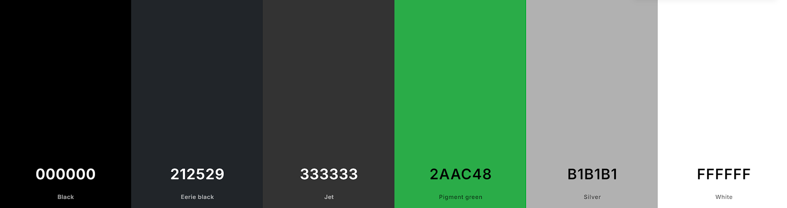

# Investnest

<a href="https://investnest-b2db9f69475b.herokuapp.com" target="_blank">Live project can be viewed here</a>

InvestNest is a full-stack web application designed to help users manage their investment portfolios. The application allows users to create, manage, and track their investment portfolios while providing real-time data integration, user-friendly reports, and robust authentication mechanisms.

# Table of Contents

# Description

InvestNest is a comprehensive investment portfolio management system that provides users with the tools to monitor and manage their investments. It integrates with real-time market data sources to keep portfolio values updated and includes powerful reporting and analytics features.

# User Experience

InvestNest is built with user experience at its core, providing intuitive navigation, clear feedback, and robust security features. Users can easily manage their portfolios, view detailed performance metrics, and customize their experience with personalized settings.

# Agile Methodology and Planning

## Epics

A total of 6 epics were designed for the project, with the project delivery focused on Epic 3. Each of Epics 1, 2, and 3 was executed in individual sprints. Epics 4, 5, and 6 are not planned for execution at this stage and are considered future expansions.

### Epic 1: Project Setup and Initial Configuration

In this epic, the primary objective is to fully establish the Django front-end website, with comprehensive content management through the admin dashboard. Key deliverables include the creation of branding elements and the development of a functional, polished landing page that reflects the final version of the site. Additionally, this epic covers the initial setup, including the installation of essential Python modules and the configuration of testing parameters to ensure the front-end website operates smoothly.

#### User Stories

- [STORY 1.1 - As a developer, I want to set up the Django environment and establish the initial project structure so that the project has a solid foundation for further development.](https://github.com/catapam/investnest/issues/106)
- [STORY 1.2 - As a developer, I want to select and configure a SQL database (MySQL or PostgreSQL) so that the project has a reliable and scalable data storage solution.](https://github.com/catapam/investnest/issues/107)
- [STORY 1.3 - As a developer, I want to deploy the Django project to Heroku so that the application is accessible online and ready for further development.](https://github.com/catapam/investnest/issues/108)
- [STORY 1.4 - As a developer, I want to create and integrate basic front-end templates so that the application has a consistent design and user experience.](https://github.com/catapam/investnest/issues/109)
- [STORY 1.5 - As a developer, I want to establish copyright, branding, and basic project documentation so that the project is legally compliant and easy to understand.](https://github.com/catapam/investnest/issues/110)
- [STORY 1.6 - As a developer, I want to implement automated testing using Python so that the project's codebase remains stable and errors are caught early in development.](https://github.com/catapam/investnest/issues/111)

### Epic 2: User Authentication and Authorization

This epic focuses on implementing a robust user authentication and authorization system. The goal is to enable secure user registration, login, and access management. Core tasks include integrating Django’s authentication framework, setting up user roles and permissions, and ensuring data security through encryption. By the end of this epic, the website will support secure user interactions, with role-based access control fully implemented.

#### User Stories

- [STORY 2.1 - As a user, I want to register an account so that I can access the system.](https://github.com/catapam/investnest/issues/2)
- [STORY 2.2 - As a user, I want to log in to my account so that I can access my portfolio.](https://github.com/catapam/investnest/issues/3)
- [STORY 2.3 - As a user, I want to reset my password if I forget it so that I can regain access to my account.](https://github.com/catapam/investnest/issues/5)
- [STORY 2.4 - As an admin, I want to assign roles to users so that I can control access to different functionalities.](https://github.com/catapam/investnest/issues/6)

### Epic 3: Portfolio Management (Project Delivery)

Epic 3 is the pivotal point of the project, where the primary delivery occurs. The focus is on delivering the project’s core functionality: a portfolio management system. This includes developing features that allow users to create, view, and manage their investment portfolios. Key aspects include data modeling, implementing portfolio tracking tools, and creating a user-friendly interface for portfolio management. This epic represents the main delivery milestone of the project, ensuring that the essential features are completed and ready for use.

#### User Stories

- [STORY 3.1 - As an investor, I want to create a new investment portfolio so that I can start tracking my investments.](https://github.com/catapam/investnest/issues/8)
- [STORY 3.2 - As an investor, I want to add assets to my portfolio so that I can track their performance.](https://github.com/catapam/investnest/issues/9)
- [STORY 3.3 - As an investor, I want to update the information of an asset in my portfolio so that it reflects the correct data.](https://github.com/catapam/investnest/issues/10)
- [STORY 3.4 - As an investor, I want to remove an asset from my portfolio so that I can keep my portfolio information current.](https://github.com/catapam/investnest/issues/11)
- [STORY 3.5 - As an investor, I want to view the performance of my portfolio so that I can monitor my investment progress.](https://github.com/catapam/investnest/issues/12)

### Epic 4: Real-Time Data Integration (Planned for Future Enhancements)

The goal of Epic 4 is to enhance the website with real-time data integration capabilities. This involves connecting the site to live data feeds, such as stock market updates, to provide users with up-to-date information. Tasks include setting up API connections, processing incoming data, and displaying it dynamically on the site. This epic is planned for future development, aiming to provide users with timely, relevant information that enhances their decision-making process.

#### User Stories

- [STORY 4.1 - As an investor, I want to get real-time price updates for my assets so that I have the latest information.](https://github.com/catapam/investnest/issues/14)
- [STORY 4.2 - As a developer, I want to integrate with market data APIs so that I can fetch real-time prices for asset](https://github.com/catapam/investnest/issues/15)
- [STORY 4.3 - As an investor, I want to receive alerts for significant price changes so that I can take timely action.](https://github.com/catapam/investnest/issues/16)

### Epic 5: Reporting and Analytics (Planned for Future Enhancements)

In this epic, the focus shifts to developing advanced reporting and analytics features. The objective is to provide users with insightful data about their investments through customizable reports and visual analytics. Core tasks include implementing data aggregation, creating various report templates, and integrating interactive charts and graphs. This epic is planned for future enhancements to empower users with detailed insights into their investment performance.

#### User Stories

- [STORY 5.1 - As an investor, I want to generate performance reports for my portfolio so that I can review my investment performance.](https://github.com/catapam/investnest/issues/18)
- [STORY 5.2 - As an investor, I want tools to analyze the risk associated with my portfolio so that I can make informed investment decisions.](https://github.com/catapam/investnest/issues/19)
- [STORY 5.3 - As an investor, I want visualizations (charts, graphs) of my portfolio data so that I can easily interpret performance and trends.](https://github.com/catapam/investnest/issues/20)

### Epic 6: User Notifications (Planned for Future Enhancements)

The final initial epic involves setting up a comprehensive user notification system. This includes the ability to send email alerts, in-app notifications, and push notifications for critical events such as portfolio updates, market changes, or new investment opportunities. The goal is to keep users informed and engaged, ensuring they never miss important information. This epic is planned for future development and will focus on enhancing user interaction and engagement through timely and relevant notifications.

#### User Stories

- [STORY 6.1 - As an investor, I want to receive notifications for successful transactions so that I am aware of any changes to my portfolio.](https://github.com/catapam/investnest/issues/22)
- [STORY 6.2 - As an investor, I want to receive alerts when my portfolio reaches certain performance thresholds so that I can take timely action.](https://github.com/catapam/investnest/issues/23)
- [STORY 6.3 - As an investor, I want to receive notifications for system updates and important announcements so that I am always informed about the platform.](https://github.com/catapam/investnest/issues/24)

## MoSCoW Methodology

The first three epics and their stories are essential for the project delivery, providing all necessary features and expected standards. Therefore, most of these tasks are classified as 'Must Have' or 'Should Have.'

User stories are broken down into tasks, where each task is categorized as 'Must Have,' 'Should Have,' 'Could Have,' or 'Won’t Have.' Each task is also assigned a story point weight of 1, 2, or 4, reflecting the effort required to complete it.

The story point weight and MoSCoW priority of each task for the three sprints (Epics 1, 2, and 3) were carefully planned to allow flexibility in execution. 'Must Haves' do not exceed 60% of the sprint's total story points. The details for each sprint are provided below:

### Sprint/Epic 1

**Story Point / MoSCoW** | **Must Have** | **Should Have** | **Could Have**
:-----:|:-----:|:-----:|:-----:
**1** | 10 | 0 | 0
**2** | 10 | 4 | 0
**4** | 1 | 2 | 2
**Total** | 34 | 16 | 8

- Total story points: 58
- Total 'Must Have': 34
- Must Have proportion: 58.62%

<a href="https://github.com/users/catapam/projects/2/insights/4" target="_blank">Sprint 1 story point weight graph</a>

### Sprint/Epic 2

**Story Point / MoSCoW** | **Must Have** | **Should Have** | **Could Have**
:-----:|:-----:|:-----:|:-----:
**1** | 4 | 3 | 0
**2** | 9 | 5 | 7
**4** | 0 | 0 | 2
**Total** | 22 | 13 | 22

- Total story points: 57
- Total 'Must Have': 22
- Must Have proportion: 38.59%

<a href="https://github.com/users/catapam/projects/2/insights/5" target="_blank">Sprint 2 story point weight graph</a>

### Sprint/Epic 3

**Story Point / MoSCoW** | **Must Have** | **Should Have** | **Could Have**
:-----:|:-----:|:-----:|:-----:
**1** | 4 | 1 | 0
**2** | 12 | 6 | 9
**4** | 1 | 1 | 4
**Total** | 32 | 17 | 34

- Total story points: 83
- Total 'Must Have': 32
- Must Have proportion: 38.55%

<a href="https://github.com/users/catapam/projects/2/insights/6" target="_blank">Sprint 3 story point weight graph</a>

## Sprint Length

Based on the total story points, Sprints 1 and 2 were set to last 2 weeks each, while Sprint 3 was extended by an additional week, making it 3 weeks long.

## Reviews

Tasks and tickets were reviewed weekly. New tickets, such as bug reports, may have been incorporated into the planning, which sometimes resulted in the removal of tasks from sprints or adjustments to their MoSCoW priorities.

# Data structure

* Data structure was created using <a href="https://drawsql.app/" target="_blank">drawSQL</a> :

# Design

InvestNest's design prioritizes a clean, user-friendly interface that supports easy navigation and data visibility. The application is structured to guide users through their investment management journey, offering clear and concise feedback at every step.

Key design principles include:
- **User-Centric Design**: Ensures that the application is intuitive and easy to use.
- **Responsive Design**: The application is fully responsive and works seamlessly across different devices.
- **Security**: Emphasis on robust security measures, including secure authentication and role-based access control.

## Color scheme

* The color scheme chosen was a dark-mode with green accents. Briging senses of elegance, security, seriousness and richness, all appealing to the target consumer.
* Used <a href="https://coolors.co/" target="_blank">Coolors</a> to create the palette:

## Typography

* The fonts were choosen on <a href="https://fonts.google.com/" target="_blank">Google fonts</a>, thinking of keeping the same sentiment as the colors passed.
* Primary font family for body text: Roboto, with fallback fonts: Arial, sans-serif
* Font family for headings: Merriweather, with fallback fonts: Georgia, serif

## Wireframes

* Wireframes were created in HTML during the branding and theme planning, it can be checked here:

<a href="https://investnest-b2db9f69475b.herokuapp.com/wireframes" target="_blank">Live wireframes for front-end site</a>

# Features

## Existing Features

* **Fully functional front-end website**: Users can learn about the product, choose plans, signin, initiad a contact and find social medias.
* **Portfolio Management**: Allows users to create, update, and delete portfolios and assets, with real-time data updates.
* **User Authentication and Authorization**: Secure login, registration, and role-based access control.

## Future Features

* **Reporting and Analytics**: Detailed performance metrics and visualizations to help users track their investments.
* **Real-Time Data Integration**: Fetches and displays up-to-date market prices for all assets in a user’s portfolio.
* **Advanced Analytics**: Introduce more advanced analytics, such as risk assessments and forecasting tools.
* **Automated Alerts**: Implement automated alerts for significant portfolio changes.
* **Portfolio Sharing**: Allow users to share their portfolios with others securely.
* **Multi-Currency Support**: Enable tracking and reporting of investments in multiple currencies.

# How to Use

1. **Register/Login**: Users must register or log in to manage their portfolios.
2. **Create Portfolio**: After logging in, users can create a new investment portfolio.
3. **Add Assets**: Users can add various assets (stocks, bonds, etc.) to their portfolios.
4. **Monitor Performance**: View the portfolio dashboard to monitor investment performance.
5. **Manage Settings**: Customize user settings and notifications from the profile section.

# Technology Used

## Languages

* Python
* Django
* Sql
* HTML
* CSS
* JavaScript

## Frameworks, Libraries, and Tools

* **Django**: The main web framework used for building the application.
* **PostgreSQL**: The relational database used to store user and portfolio data.
* **Bootstrap**: For responsive design and styling.
* **AllAuth**: For user authentication
* **Crispy Forms**: For all forms
* **Chart.js**: For data visualizations in the performance dashboard.
* **Heroku**: For application deployment.
* **Git**: For version control.
* **google-webfonts-helper**: For downloadable fonts that can be hosted locally avoiding layout shifts caused by slow response from Google fonts

# Deployment

To deploy the application on Heroku:

1. Visit the Heroku website, log in, or create a new account.
2. On the dashboard, click "New" and select "Create new app."
3. Enter a unique app name and choose a region.
4. Click "Create app."
5. Navigate to the "Settings" tab and find "Config Vars."
6. Click "Reveal Config Vars," add "PORT" as a key with the value "8000," and click "Add."
7. Scroll down to the "Buildpacks" section, click "Add buildpack," and select "Python."
8. Repeat step 7 to add "Node.js," ensuring "Python" is listed first.
9. Scroll to the top and select the "Deploy" tab.
10. Choose GitHub as the deployment method, then search for your repository and click "Connect."
11. Scroll down and either "Enable Automatic Deploys" to update the code each time it is pushed to GitHub, or choose "Manual Deploy" for manual updates.

# Testing

- Testing was mainly made using Google Chrome Developer Tools, including the mobile and responsive views.
- Lighthouse tab of developer tools was used to score the site regarding Performance, Acessibility and SEO.
- The site was tested on other devices using Edge, Firefox and Safari. When testing on desktops with OS: Mac iOS and Windows 11. And on mobile OS: Android and iOS.
- The apps Operations, Metrics and Contacts are not being tested at this point as they are just place holders at this point in time.

## HTML, accessibility and performance

| **Page** | **<a href="https://validator.w3.org/nu/#textarea" target="_blank">W3C Markup validator</a>** | **<a href="https://wave.webaim.org/" target="_blank">Wave accessibility</a>** | **Performance** | **Acessibility** | **Best practices** | **SEO** |
|------------------------------------------|------------|------------|------------|------------|------------|------------|
| Home | Passed | Passed | <a href="/documentation/tests/home-mobile.html" target="_blank">M:92</a> <a href="/documentation/tests/home-desktop.html" target="_blank">D:94</a> | <a href="/documentation/tests/home-mobile.html" target="_blank">M:100</a> <a href="/documentation/tests/home-desktop.html" target="_blank">D:100</a> | <a href="/documentation/tests/home-mobile.html" target="_blank">M:100</a> <a href="/documentation/tests/home-desktop.html" target="_blank">D:100</a> | <a href="/documentation/tests/home-mobile.html" target="_blank">M:100</a> <a href="/documentation/tests/home-desktop.html" target="_blank">D:100</a> |
| 401 | Passed | Passed | <a href="/documentation/tests/401-mobile.html" target="_blank">M:98</a> <a href="/documentation/tests/401-desktop.html" target="_blank">D:98</a> | <a href="/documentation/tests/401-mobile.html" target="_blank">M:100</a> <a href="/documentation/tests/401-desktop.html" target="_blank">D:100</a> | <a href="/documentation/tests/401-mobile.html" target="_blank">M:96</a> <a href="/documentation/tests/401-desktop.html" target="_blank">D:96</a> | <a href="/documentation/tests/401-mobile.html" target="_blank">M:91</a> <a href="/documentation/tests/401-desktop.html" target="_blank">D:91</a> |
| 404 | Passed | Passed | <a href="/documentation/tests/404-mobile.html" target="_blank">M:95</a> <a href="/documentation/tests/404-desktop.html" target="_blank">D:96</a> | <a href="/documentation/tests/404-mobile.html" target="_blank">M:100</a> <a href="/documentation/tests/404-desktop.html" target="_blank">D:100</a> | <a href="/documentation/tests/404-mobile.html" target="_blank">M:96</a> <a href="/documentation/tests/404-desktop.html" target="_blank">D:96</a> | <a href="/documentation/tests/404-mobile.html" target="_blank">M:91</a> <a href="/documentation/tests/404-desktop.html" target="_blank">D:91</a> |
| Account / Login | Passed | Passed | <a href="/documentation/tests/login-mobile.html" target="_blank">M:93</a> <a href="/documentation/tests/login-desktop.html" target="_blank">D:98</a> | <a href="/documentation/tests/login-mobile.html" target="_blank">M:100</a> <a href="/documentation/tests/login-desktop.html" target="_blank">D:100</a> | <a href="/documentation/tests/login-mobile.html" target="_blank">M:100</a> <a href="/documentation/tests/login-desktop.html" target="_blank">D:100</a> | <a href="/documentation/tests/login-mobile.html" target="_blank">M:100</a> <a href="/documentation/tests/login-desktop.html" target="_blank">D:100</a> |
| Account / Register | Passed | Passed | <a href="/documentation/tests/register-mobile.html" target="_blank">M:96</a> <a href="/documentation/tests/register-desktop.html" target="_blank">D:96</a> | <a href="/documentation/tests/register-mobile.html" target="_blank">M:100</a> <a href="/documentation/tests/register-desktop.html" target="_blank">D:100</a> | <a href="/documentation/tests/register-mobile.html" target="_blank">M:100</a> <a href="/documentation/tests/register-desktop.html" target="_blank">D:100</a> | <a href="/documentation/tests/register-mobile.html" target="_blank">M:100</a> <a href="/documentation/tests/register-desktop.html" target="_blank">D:100</a> |
| Account / Logout | Passed | Passed | <a href="/documentation/tests/logout-mobile.html" target="_blank">M:90</a> <a href="/documentation/tests/logout-desktop.html" target="_blank">D:90</a> | <a href="/documentation/tests/logout-mobile.html" target="_blank">M:100</a> <a href="/documentation/tests/logout-desktop.html" target="_blank">D:100</a> | <a href="/documentation/tests/logout-mobile.html" target="_blank">M:100</a> <a href="/documentation/tests/logout-desktop.html" target="_blank">D:100</a> | <a href="/documentation/tests/logout-mobile.html" target="_blank">M:100</a> <a href="/documentation/tests/logout-desktop.html" target="_blank">D:100</a> |
| Account / User edit | Passed | Passed | <a href="/documentation/tests/account-user-mobile.html" target="_blank">M:94</a> <a href="/documentation/tests/account-user-desktop.html" target="_blank">D:94</a> | <a href="/documentation/tests/account-user-mobile.html" target="_blank">M:100</a> <a href="/documentation/tests/account-user-desktop.html" target="_blank">D:100</a> | <a href="/documentation/tests/account-user-mobile.html" target="_blank">M:100</a> <a href="/documentation/tests/account-user-desktop.html" target="_blank">D:100</a> | <a href="/documentation/tests/account-user-mobile.html" target="_blank">M:100</a> <a href="/documentation/tests/account-user-desktop.html" target="_blank">D:100</a> |
| Account / Email edit | Passed | Passed | <a href="/documentation/tests/account-email-mobile.html" target="_blank">M:86</a> <a href="/documentation/tests/account-email-desktop.html" target="_blank">D:94</a> | <a href="/documentation/tests/account-email-mobile.html" target="_blank">M:100</a> <a href="/documentation/tests/account-email-desktop.html" target="_blank">D:100</a> | <a href="/documentation/tests/account-email-mobile.html" target="_blank">M:100</a> <a href="/documentation/tests/account-email-desktop.html" target="_blank">D:100</a> | <a href="/documentation/tests/account-email-mobile.html" target="_blank">M:100</a> <a href="/documentation/tests/account-email-desktop.html" target="_blank">D:100</a> |
| Account / Password change | Passed | Passed | <a href="/documentation/tests/change-password-mobile.html" target="_blank">M:87</a> <a href="/documentation/tests/change-password-desktop.html" target="_blank">D:93</a> | <a href="/documentation/tests/change-password-mobile.html" target="_blank">M:100</a> <a href="/documentation/tests/change-password-desktop.html" target="_blank">D:100</a> | <a href="/documentation/tests/change-password-mobile.html" target="_blank">M:100</a> <a href="/documentation/tests/change-password-desktop.html" target="_blank">D:100</a> | <a href="/documentation/tests/change-password-mobile.html" target="_blank">M:100</a> <a href="/documentation/tests/change-password-desktop.html" target="_blank">D:100</a> |
| Account / Password reset | Passed | Passed | <a href="/documentation/tests/password-reset-mobile.html" target="_blank">M:88</a> <a href="/documentation/tests/password-reset-desktop.html" target="_blank">D:99</a> | <a href="/documentation/tests/password-reset-mobile.html" target="_blank">M:100</a> <a href="/documentation/tests/password-reset-desktop.html" target="_blank">D:100</a> | <a href="/documentation/tests/password-reset-mobile.html" target="_blank">M:100</a> <a href="/documentation/tests/password-reset-desktop.html" target="_blank">D:100</a> | <a href="/documentation/tests/password-reset-mobile.html" target="_blank">M:100</a> <a href="/documentation/tests/password-reset-desktop.html" target="_blank">D:100</a> |
| Account / Password reset email sent | Passed | Passed | <a href="/documentation/tests/password-reset-done-mobile.html" target="_blank">M:96</a> <a href="/documentation/tests/password-reset-done-desktop.html" target="_blank">D:95</a> | <a href="/documentation/tests/password-reset-done-mobile.html" target="_blank">M:100</a> <a href="/documentation/tests/password-reset-done-desktop.html" target="_blank">D:100</a> | <a href="/documentation/tests/password-reset-done-mobile.html" target="_blank">M:100</a> <a href="/documentation/tests/password-reset-done-desktop.html" target="_blank">D:100</a> | <a href="/documentation/tests/password-reset-done-mobile.html" target="_blank">M:100</a> <a href="/documentation/tests/password-reset-done-desktop.html" target="_blank">D:100</a> |
| Account / Reset password from email key | Passed | Passed | <a href="/documentation/tests/password-reset-from-key-mobile.html" target="_blank">M:97</a> <a href="/documentation/tests/password-reset-from-key-desktop.html" target="_blank">D:98</a> | <a href="/documentation/tests/password-reset-from-key-mobile.html" target="_blank">M:100</a> <a href="/documentation/tests/password-reset-from-key-desktop.html" target="_blank">D:100</a> | <a href="/documentation/tests/password-reset-from-key-mobile.html" target="_blank">M:100</a> <a href="/documentation/tests/password-reset-from-key-desktop.html" target="_blank">D:100</a> | <a href="/documentation/tests/password-reset-from-key-mobile.html" target="_blank">M:100</a> <a href="/documentation/tests/password-reset-from-key-desktop.html" target="_blank">D:100</a> |
| Account / Confirmation email from email key | Passed | Passed | <a href="/documentation/tests/confirm-email-mobile.html" target="_blank">M:94</a> <a href="/documentation/tests/confirm-email-desktop.html" target="_blank">D:93</a> | <a href="/documentation/tests/confirm-email-mobile.html" target="_blank">M:100</a> <a href="/documentation/tests/confirm-email-desktop.html" target="_blank">D:100</a> | <a href="/documentation/tests/confirm-email-mobile.html" target="_blank">M:100</a> <a href="/documentation/confirm-email-desktop.html" target="_blank">D:100</a> | <a href="/documentation/tests/confirm-email-mobile.html" target="_blank">M:100</a> <a href="/documentation/tests/confirm-email-desktop.html" target="_blank">D:100</a> |
| Dashboard / Main | Passed | Passed |
| Dashboard / Portfolio / Overview | Passed | Passed | <a href="/documentation/tests/portfolio-list-mobile.html" target="_blank">M:88</a> <a href="/documentation/tests/portfolio-list-desktop.html" target="_blank">D:84</a> | <a href="/documentation/tests/portfolio-list-mobile.html" target="_blank">M:100</a> <a href="/documentation/tests/portfolio-list-desktop.html" target="_blank">D:100</a> | <a href="/documentation/tests/portfolio-list-mobile.html" target="_blank">M:100</a> <a href="/documentation/tests/portfolio-list-desktop.html" target="_blank">D:100</a> | <a href="/documentation/tests/portfolio-list-mobile.html" target="_blank">M:100</a> <a href="/documentation/tests/portfolio-list-desktop.html" target="_blank">D:100</a> |
| Dashboard / Portfolio / Create Portfolio | Passed | Passed | <a href="/documentation/tests/portfolio-create-mobile.html" target="_blank">M:90</a> <a href="/documentation/tests/portfolio-create-desktop.html" target="_blank">D:92</a> | <a href="/documentation/tests/portfolio-create-mobile.html" target="_blank">M:100</a> <a href="/documentation/tests/portfolio-create-desktop.html" target="_blank">D:100</a> | <a href="/documentation/tests/portfolio-create-mobile.html" target="_blank">M:100</a> <a href="/documentation/tests/portfolio-create-desktop.html" target="_blank">D:100</a> | <a href="/documentation/tests/portfolio-create-mobile.html" target="_blank">M:100</a> <a href="/documentation/tests/portfolio-create-desktop.html" target="_blank">D:100</a> |
| Dashboard / Portfolio / Create Asset | Passed | Passed | <a href="/documentation/tests/transaction-form-mobile.html" target="_blank">M:83</a> <a href="/documentation/tests/transaction-form-desktop.html" target="_blank">D:90</a> | <a href="/documentation/tests/transaction-form-mobile.html" target="_blank">M:100</a> <a href="/documentation/tests/transaction-form-desktop.html" target="_blank">D:100</a> | <a href="/documentation/tests/transaction-form-mobile.html" target="_blank">M:100</a> <a href="/documentation/tests/transaction-form-desktop.html" target="_blank">D:100</a> | <a href="/documentation/tests/transaction-form-mobile.html" target="_blank">M:100</a> <a href="/documentation/tests/transaction-form-desktop.html" target="_blank">D:100</a> |
| Dashboard / Portfolio / Delete confirmation | Passed | Passed | <a href="/documentation/tests/delete-confirmation-mobile.html" target="_blank">M:90</a> <a href="/documentation/tests/delete-confirmation-desktop.html" target="_blank">D:91</a> | <a href="/documentation/tests/delete-confirmation-mobile.html" target="_blank">M:100</a> <a href="/documentation/tests/delete-confirmation-desktop.html" target="_blank">D:100</a> | <a href="/documentation/tests/delete-confirmation-mobile.html" target="_blank">M:100</a> <a href="/documentation/tests/delete-confirmation-desktop.html" target="_blank">D:100</a> | <a href="/documentation/tests/delete-confirmation-mobile.html" target="_blank">M:100</a> <a href="/documentation/tests/delete-confirmation-desktop.html" target="_blank">D:100</a> |
| Dashboard / Portfolio / Asset view | Passed | Passed | <a href="/documentation/tests/asset-view-mobile.html" target="_blank">M:86</a> <a href="/documentation/tests/asset-view-desktop.html" target="_blank">D:94</a> | <a href="/documentation/tests/asset-view-mobile.html" target="_blank">M:100</a> <a href="/documentation/tests/asset-view-desktop.html" target="_blank">D:100</a> | <a href="/documentation/tests/asset-view-mobile.html" target="_blank">M:100</a> <a href="/documentation/tests/asset-view-desktop.html" target="_blank">D:100</a> | <a href="/documentation/tests/asset-view-mobile.html" target="_blank">M:100</a> <a href="/documentation/tests/asset-view-desktop.html" target="_blank">D:100</a> |

* Passed state means the test was run, and returned no errors or alerts
* Due to the nature of dashboard pages, Wave was run using the browser extension rather than the site tool.
* M=mobile, D=desktop.
* Performance issues caused by initial server response (TTFB) were ignored due to the server were the current site is hosted being a free version of a third party service I don't have much control over. Initial server response may also be result of slow postgress queries, which is not the focus for this project, those can be dealt with once the site is deployed to a permanent server
* Render blocking issues were avoided whenever possible, and only left when optimizing caused major layout shifts.

## CSS
| **File** | **<a href="https://jigsaw.w3.org/css-validator/" target="_blank">WC3 CSS validator</a>** |
|----------|----------------------------|
| <a href="static/css/auth.css" target="_blank">auth.css</a> | Level 3 + SVG |
| <a href="static/css/base.css" target="_blank">base.css</a> | Level 3 + SVG |
| <a href="static/css/dashboard.css" target="_blank">dashboard.css</a> | Level 3 + SVG |
| <a href="static/css/error.css" target="_blank">error.css</a> | Level 3 + SVG |
| <a href="static/css/fonts.css" target="_blank">fonts.css</a> | Level 3 + SVG |
| <a href="static/css/footer.css" target="_blank">footer.css</a> | Level 3 + SVG |
| <a href="static/css/home.css" target="_blank">home.css</a> | Level 3 + SVG |
| <a href="static/css/portfolio.css" target="_blank">portfolio.css</a> | Level 3 + SVG |

## Java Script
| **File** | **<a href="https://jshint.com/" target="_blank">JS hint ES6</a>** |
|----------|----------------------------|
| <a href="static/js/asset.js" target="_blank">asset.js</a> | Passed |
| <a href="static/js/base.js" target="_blank">base.js</a> | Passed |
| <a href="static/js/dashboard.js" target="_blank">dashboard.js</a> | Passed |
| <a href="static/js/home.js" target="_blank">home.js</a> | Passed |
| <a href="static/js/portfolio_header.js" target="_blank">portfolio_header.js</a> | Passed |
| <a href="static/js/portfolio.js" target="_blank">portfolio.js</a> | Passed |
| <a href="static/js/sort_table.js" target="_blank">sort_table.js</a> | Passed |
| <a href="static/js/transaction.js" target="_blank">transaction.js</a> | Passed |

## Python
| **File** | **<a href="https://pep8ci.herokuapp.com/" target="_blank">PEP8 validator</a>** |
|----------|-------------------------|
| <a href="manage.py" target="_blank">manage.py</a> | Passed |
| <a href="main/admin.py" target="_blank">main/admin.py</a> | Passed |
| <a href="main/apps.py" target="_blank">main/apps.py</a> | Passed |
| <a href="main/asgi.py" target="_blank">main/asgi.py</a> | Passed |
| <a href="main/settings.py" target="_blank">main/settings.py</a> | Passed |
| <a href="main/signals.py" target="_blank">main/signals.py</a> | Passed |
| <a href="main/urls.py" target="_blank">main/urls.py</a> | Passed |
| <a href="main/view.py" target="_blank">main/views.py</a> | Passed |
| <a href="main/wsgi.py" target="_blank">main/wsgi.py</a> | Passed |
| <a href="home/apps.py" target="_blank">home/apps.py</a> | Passed |
| <a href="home/apps.py" target="_blank">home/apps.py</a> | Passed |
| <a href="home/forms.py" target="_blank">home/forms.py</a> | Passed |
| <a href="home/models.py" target="_blank">home/models.py</a> | Passed |
| <a href="home/signals.py" target="_blank">home/signals.py</a> | Passed |
| <a href="home/urls.py" target="_blank">home/urls.py</a> | Passed |
| <a href="home/views.py" target="_blank">home/views.py</a> | Passed |
| <a href="account/admin.py" target="_blank">account/admin.py</a> | Passed |
| <a href="account/apps.py" target="_blank">account/apps.py</a> | Passed |
| <a href="account/forms.py" target="_blank">account/forms.py</a> | Passed |
| <a href="account/middleware.py" target="_blank">account/middleware.py</a> | Passed |
| <a href="account/models.py" target="_blank">account/models.py</a> | Passed |
| <a href="account/urls.py" target="_blank">account/urls.py</a> | Passed |
| <a href="account/views.py" target="_blank">account/views.py</a> | Passed |
| <a href="dashboard/admin.py" target="_blank">dashboard/admin.py</a> | Passed |
| <a href="dashboard/apps.py" target="_blank">dashboard/apps.py</a> | Passed |
| <a href="dashboard/context_processor.py" target="_blank">dashboard/context_processor.py</a> | Passed |
| <a href="dashboard/models.py" target="_blank">dashboard/models.py</a> | Passed |
| <a href="dashboard/urls.py" target="_blank">dashboard/urls.py</a> | Passed |
| <a href="dashboard/views.py" target="_blank">dashboard/views.py</a> | Passed |
| <a href="portfolio/templatetags/custom_filters.py" target="_blank">portfolio/templatetags/custom_filters.py</a> | Passed |
| <a href="portfolio/apps.py" target="_blank">portfolio/apps.py</a> | Passed |
| <a href="portfolio/forms.py" target="_blank">portfolio/forms.py</a> | Passed |
| <a href="portfolio/mixins.py" target="_blank">portfolio/mixins.py</a> | Passed |
| <a href="portfolio/models.py" target="_blank">portfolio/models.py</a> | Passed |
| <a href="portfolio/urls.py" target="_blank">portfolio/urls.py</a> | Passed |
| <a href="portfolio/views.py" target="_blank">portfolio/views.py</a> | Passed |

## Manual testing

### Menu (logged out)
| **Location** | **Test** | **Expected result** | **Actual result mobile** | **Actual result desktop** |
|----------|----------|---------------------|--------------------------|---------------------------|
| Any page | Click sandwich menu button | Menu is shown as sort of drop down menu | Passed | N/a |
| Any page | Click the logo/brand | Scroll to Hero image section | Passed | Passed | 
| Any page | Select "Home" from navbar/sandwich menu | Scroll to Hero image section | Passed | Passed | 
| Any page | Select "About" from navbar/sandwich menu | Scroll to About section | Passed | Passed |
| Any page | Select "Services" from navbar/sandwich menu | Scroll to Services section | Passed | Passed |
| Any page | Select "Pricing" from navbar/sandwich menu | Scroll to Pricing section | Passed | Passed |
| Any page | Select "Contact" from navbar/sandwich menu | Scroll to Contact section | Passed | Passed |
| Any page | Select "Contact" from navbar/sandwich menu | Scroll to Contact section | Passed | Passed |
| Any page | Select "Login" from navbar/sandwich menu | Redirects to Login/Signin page | Passed | Passed |
| Any page | Select "Register" from navbar/sandwich menu | Redirects to Register/signup page | Passed | Passed |

### Home
| **Location** | **Test** | **Expected result** | **Actual result mobile** | **Actual result desktop** |
|----------|----------|---------------------|--------------------------|---------------------------|
| Home | Scroll down | Menu activate and URL changes selection as the sections are passed | N/a | Passed |
| Home | Click "View services" at the hero section | Auto scroll to services section + URL changes | Passed | Passed |
| Home | Click "Get in touch" at the About section | Auto scroll to Contact section + URL changes | Passed | Passed |
| Home | Click "Get in touch" at the About section | Auto scroll to Contact section + URL changes | Passed | Passed |
| Home | Click any cards at the Service section | Card flips revealing more details about the service | Passed | Passed |
| Home | Check cards at the Service section | They are all the same size and only 3 are visible in the correct order as the DB | Passed | Passed |
| Home | Check cards at the Service section | They are all the same size and only 3 are visible | Passed | Passed |
| Home | Click "Get started" at the first card on Pricing section | Redirects to Register page | Passed | Passed |
| Home | Click "Wait list" or "Get in touch" at the 2nd and 3rd cards on Pricing section | Redirects to Contac section | Passed | Passed |

### Contact form
| **Location** | **Test** | **Expected result** | **Actual result mobile** | **Actual result desktop** |
|----------|----------|---------------------|--------------------------|---------------------------|
| Home | Test with invalid data | Submission is not allowed and alert is returned on the incorrect field | Passed | Passed |
| Home | Test with valid data | Submission goes through, reloads home page, scrolling back to top and showing a sucessful message on a pop-up at the top and also at the contact form location | Passed | Passed |

### Footer
| **Location** | **Test** | **Expected result** | **Actual result mobile** | **Actual result desktop** |
|----------|----------|---------------------|--------------------------|---------------------------|
| Any page | Only visible at home page | Scroll to the bottom of all pages and check if footer with social medias is visible | Passed | Passed |
| Home | Test social media links | When clicked opens a new tab of the respective social media, get's marked as active after clicked | Passed | Passed |

### Allauth frontend pages
| **Location** | **Test** | **Expected result** | **Actual result mobile** | **Actual result desktop** |
|----------|----------|---------------------|--------------------------|---------------------------|
| Login | Click Signup from suggested hyperlink | Redirects to Register/signup page | Passed | Passed |
| Login | Submit invalid data | Page reloads showing what was invalid | Passed | Passed |
| Login | Submit valid data | Redirect to Dashboard Main page and a Welcome popup shows up with the user name | Passed | Passed |
| Login | Submit valid data, with selecting remember me option | Same behavior as above, but user remains logged in even if page is closed | Passed | Passed |
| Login | Click "Forgot Password" option | Redirect to password reset page | Passed | Passed |
| Password reset request | Submit valid user email address, test link received by email | Redirects to "Password reset done" + Recovery email is sent with recovery link + Link redirects to "Password Reset with key" page | Passed | Passed |
| Password reset request | Submit invalid/user-not-created email address, test link received by email | Redirects to "Password reset done" + Recovery email is still sent, but informing the email address does not have an account and how to create one, link redirects to Register page | Passed | Passed |
| Register | Click Signin from suggested hyperlink | Redirects to Login/signin page | Passed | Passed |
| Register | Submit invalid data, like email not having @ symbol, password too short or weak, password does not match | Page reloads showing which fields are invalid and instructions of valid input | Passed | Passed |
| Register | Submit valid data | Redirects to Login page showing a popup infrming the confrmation email was sent | Passed | Passed |
| Confirmation email | Click on the confirmation link first time | Redirects to Confirmation page | Passed | Passed |
| Confirmation email | Click on the confirmation after confirmation | Redirects to Confirmation page informing the link is expired | Passed | Passed |
| Confirmation page | Click on the confirmation button | Redirects to Login page | Passed | Passed |
| Admin panel | Open /admin URL | If not logged as superuser, redirects to custom login page | Passed | Passed |

### General dashboard
| **Location** | **Test** | **Expected result** | **Actual result mobile** | **Actual result desktop** |
|----------|----------|---------------------|--------------------------|---------------------------|
| After login in | Check redirects | Correct page is loaded, "main" by defaul or specific page if requested pre-login, pop-up shows up welcoming user | Passed | Passed |
| Side menu | Operations menu visibility | Only visible if logged as Superuser or Staff | Passed | Passed |
| Side menu | Admin menu visibility | Only visible if logged as Superuser | Passed | Passed |
| Side menu | Active state after selection | Menu option should change background and border to make it merge with the main content area | Passed | Passed |
| Side menu | Operations, Admin and logout location | Those should always be alligned to the bottom of the screen | Passed | Passed |
| Side menu | Other menu options location | Those should always be alligned to the top of the screen | Passed | Passed |
| Side menu | Collapsable | Clicking the arrow button, should collapse/uncollpase | Passed | Passed |
| Side menu | Collapse menu arrow | View arrow changing directions depending on the state | Passed | Passed |
| Side menu | Mobile starts collpased | When loading from mobile the menu should start collpased, but uncollpasing stil works by clicking the arrow | Passed | N/a |
| Side menu | Redirect when menu option is clicked | Check if each menu redirects to the expected page according to urls.py files | Passed | Passed |

### Allauth pages (logged in)
| **Location** | **Test** | **Expected result** | **Actual result mobile** | **Actual result desktop** |
|----------|----------|---------------------|--------------------------|---------------------------|
| Account / User | Submit the user change using a unique name on the database | Redirects to Main dashboard page and shows a pop-up confirming the change | Passed | Passed |
| Account / User | Submit the user change using a name already in use | Refreshes page showing the error on the form submission and error pop-up shows up informing the change was not made | Passed | Passed |
| Account / Email | Add new unique email address | Refreshes page showing a pop-up confirming the domain was added, email is sent to confirm email verification, email is populated to the list showing state unvirified | Passed | Passed |
| Account / Email | Add new unique email address | Refreshes page showing a pop-up confirming the domain was added, email is sent to confirm email verification, email is populated to the list showing state unvirified | Passed | Passed |
| Account / Email | Add email address used on this account or any other on the database | Shows error alert on the form informing about the email being already in use | Passed | Passed |
| Account / Email | Change primary email address, by selecting a new email address on the list and clicking the "Make primary" button | Refreshes page, show pop-up informing the change was completed or error in case it fails, updates the list to show the primary email address on the top and with the correct tag label associated | Passed | Passed |
| Account / Email | Select email address from list and click re-send verification | Refreshes page and shows pop-up informing the email was sent | Passed | Passed |
| Account / Email | Select email address from list and click remove | Confirmation pop-up asking for confrimation before proceeding, once confirmed the page refreshes and a pop-up shows up informing the action was completed, email is removed from database and list | Passed | Passed |
| Account / Password | Submit with invalid data, either wrong 'current passowrd', unmatching 'new password' or invalid 'new password' (too weak) | Page refreshes with form showing which details are incorrect | Passed | Passed |
| Account / Password | Submit with valid data, correct 'current passowrd', matching 'new password' and valid new password format | Page refreshes showing a pop-up confriming the change | Passed | Passed |
| Account / Password | Click 'forgot password' | Redirects to reset password pagem where email address is requested to send the reset email | Passed | Passed |
| Account / Password reset | Same as non-logged in tests for this page | - | Passed | Passed |

### Portfolio
| **Location** | **Test** | **Expected result** | **Actual result mobile** | **Actual result desktop** |
|----------|----------|---------------------|--------------------------|---------------------------|
| Portfolio View |  |  | Passed | Passed |

## Bugs

During tests the following bugs were found

| **Bug** | **Replication** | **Troubleshooting** | **Fix** |
|---------|-----------------|---------------------|---------|
| Sending emails blocked by receiver | Trying to reset password or confirm email | Checked error returned by email of receiver blocking it, which pointed to the fix | Issue was related to the domain used on the email setup, changing it to a default GMAIL address fixed it. Other workarounds would include DMARC record added to the DNS setup of the domain linked to the email address used, as that was not achievable at this point, the first fix was implemented |
| Menu for Porfolio header options would break collapse state when resizing | Changing the size of screen after activating the collpased state, would make the collpased menu get stuck | Checked the function and calls to it to make sure the resizing event was triggering the change too | The function was not being called on resizeing events, adding it fixed the feature |

# Credits

## Code

Two youtube videos were of grand relevance as guidance for coding:
* <a href="https://www.youtube.com/watch?v=sBjbty691eI&list=PLXuTq6OsqZjbCSfiLNb2f1FOs8viArjWy" target="_blank">Initial setup and general settings</a> 
*  <a href="https://www.youtube.com/watch?v=WbNNESIxJnY&t=9796s" target="_blank">Saas specifics and more advanced development</a> 

## Content

* ChatGPT: For text reviews and copywriting assistance.

# Acknowledgements

* Gareth Mc Girr: My mentor, for all the help and advice throughout the project.
* Code Institute: For all the training and guidance.
* WP Engine: My current employer, for providing all the support necessary and allowing great networking.